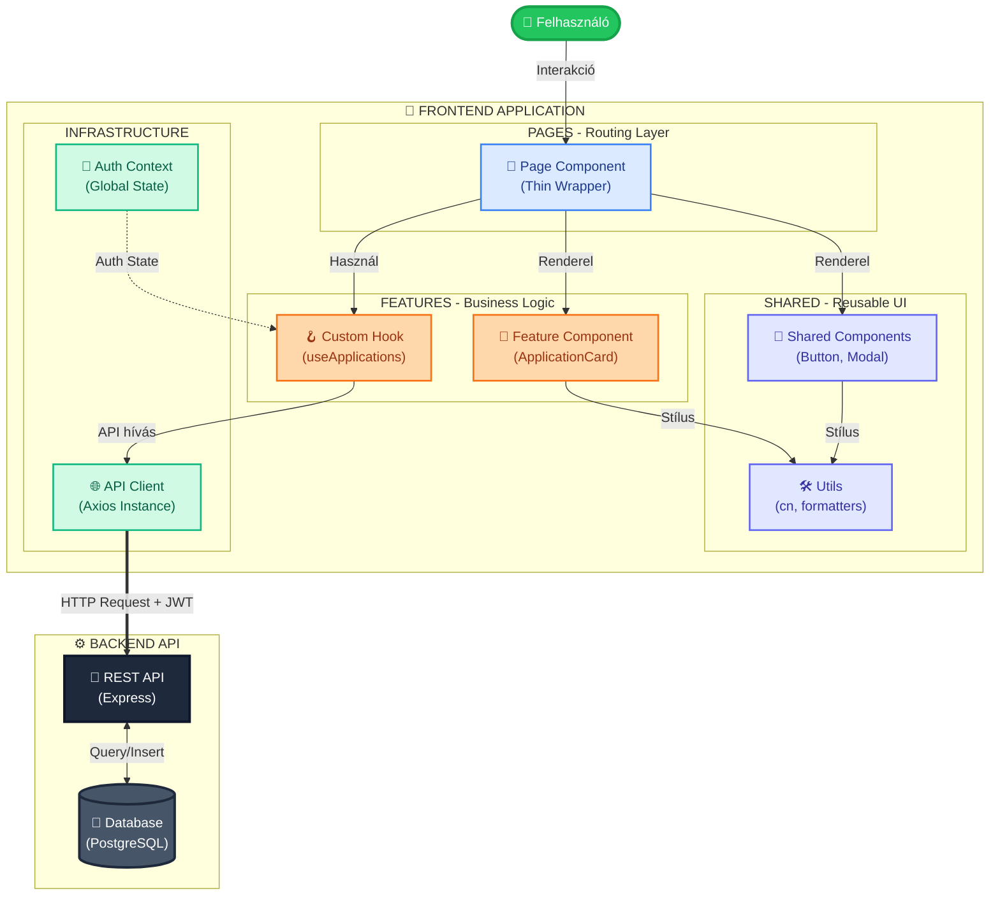
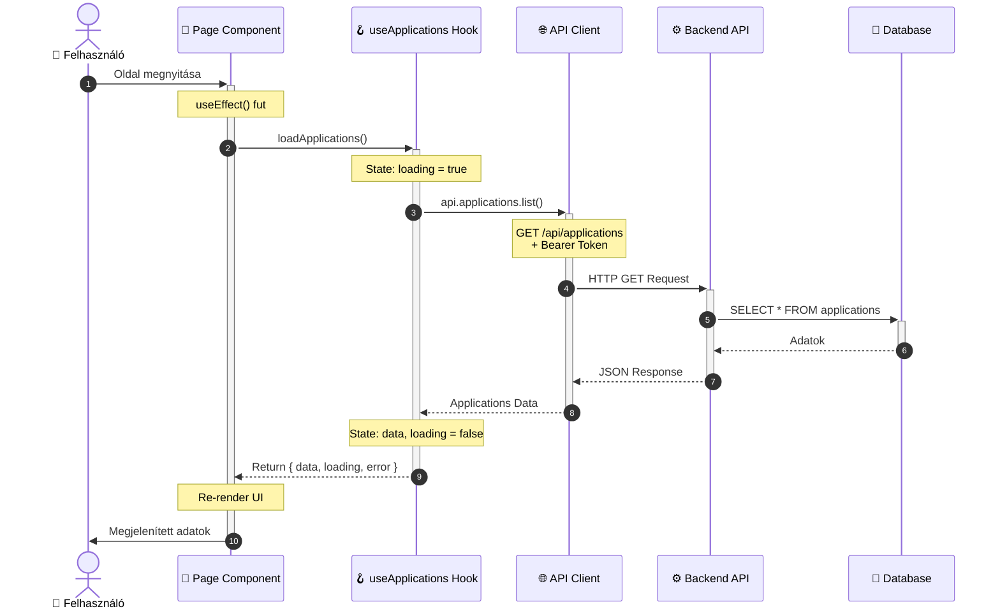
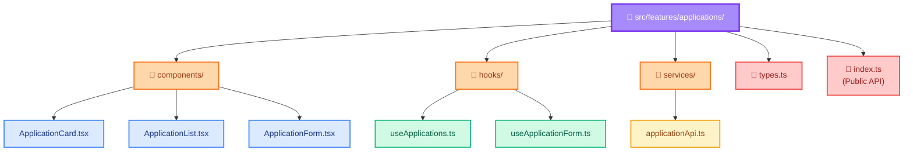
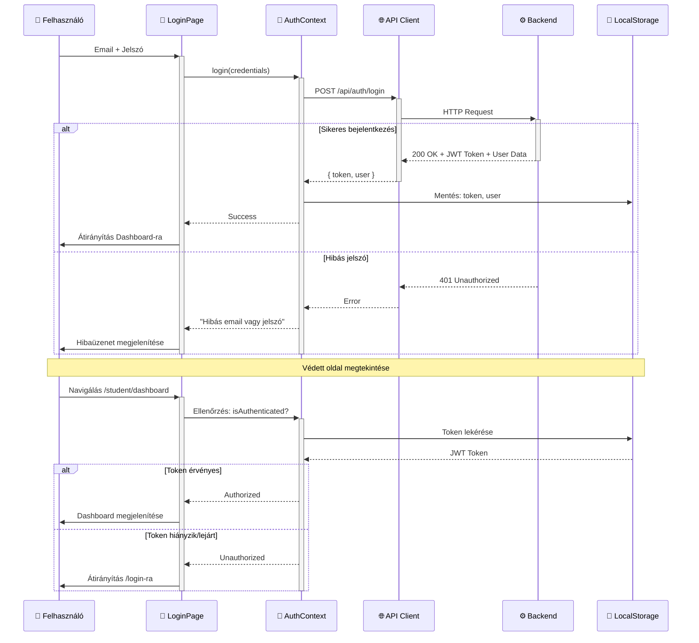

# Duális Képzés Frontend

Ez a repository a Duális Képzés rendszer frontend alkalmazását tartalmazza. Az alkalmazás célja a hallgatók, cégek, egyetemi szereplők és a duális képzés adminisztrációjának támogatása egy modern, reszponzív és felhasználóbarát webes felületen keresztül.

## 🛠 Technológia Stack

A projekt modern, iparági sztenderd technológiákra épül:

- **Framework**: [React 19](https://react.dev/) - Modern UI könyvtár komponens-alapú fejlesztéshez
- **Nyelv**: [TypeScript](https://www.typescriptlang.org/) - Típusbiztos JavaScript, amely növeli a kód megbízhatóságát
- **Build Tool**: [Vite](https://vite.dev/) - Villámgyors fejlesztői környezet és build eszköz
- **Routing**: [React Router v7](https://reactrouter.com/) - Deklaratív routing és navigáció
- **Styling**: [Tailwind CSS](https://tailwindcss.com/) - Utility-first CSS framework
- **Térkép**: [Leaflet](https://leafletjs.com/) + [React Leaflet](https://react-leaflet.js.org/) - Interaktív térképes megjelenítés
- **Ikonok**: [Lucide React](https://lucide.dev/) - Modern, testreszabható ikonkészlet
- **State Management**: React Context API - Globális állapotkezelés (Auth)
- **HTTP Client**: Axios wrapper - Típusbiztos API kommunikáció
- **Export**: [SheetJS (xlsx)](https://sheetjs.com/) - Excel export funkcionalitás

## 🚀 Előfeltételek

A fejlesztői környezet futtatásához szükséges szoftverek:

- **Node.js**: Legalább v18.x verzió
- **npm**: Csomagkezelő (általában a Node.js része)
- **Backend API**: Futó backend szerver (lásd: [Backend Repository](https://github.com/DrozsdikAdam/dual-kepzes-backend))

## 📥 Telepítés és Indítás

1. **Repository klónozása**

   ```bash
   git clone https://github.com/myloo23/dual-kepzes-frontend.git
   cd dual-kepzes-frontend
   ```

2. **Függőségek telepítése**

   ```bash
   npm install
   ```

3. **Környezeti változók beállítása**
   Hozd létre a `.env` fájlt a gyökérkönyvtárban:

   ```env
   # Backend API URL
   VITE_API_URL=http://localhost:3000
   ```

4. **Szerver indítása (Fejlesztői mód)**
   ```bash
   npm run dev
   ```
   Az alkalmazás elindul a `http://localhost:5173` címen.

## 📜 Elérhető Szkriptek

A `package.json`-ben definiált főbb parancsok:

| Parancs           | Leírás                                               |
| :---------------- | :--------------------------------------------------- |
| `npm run dev`     | Fejlesztői szerver indítása hot-reload módban.       |
| `npm run build`   | TypeScript fordítás és production build létrehozása. |
| `npm run preview` | Production build előnézete lokálisan.                |
| `npm run lint`    | Kódminőség ellenőrzése (ESLint).                     |

## 🏗 Projekt Struktúra

```
src/
├── features/          # Funkció-alapú modulok (Feature-Based Architecture)
│   ├── auth/          # Autentikáció (Login, Register, AuthContext)
│   ├── users/         # Felhasználókezelés (Profilok)
│   ├── companies/     # Cégek kezelése
│   ├── positions/     # Álláshelyek/Pozíciók
│   ├── applications/  # Jelentkezések
│   ├── partnerships/  # Duális partnerségek
│   ├── news/          # Hírek
│   ├── notifications/ # Értesítések
│   └── landing/       # Publikus landing oldalak
├── pages/             # Route komponensek (Thin Pages)
│   ├── landing/       # Publikus oldalak
│   ├── auth/          # Login/Register
│   ├── admin/         # Admin dashboard
│   ├── student/       # Hallgatói dashboard
│   ├── hr/            # HR dashboard
│   ├── mentor/        # Mentor dashboard
│   ├── teacher/       # Oktatói dashboard
│   └── university/    # Egyetemi dashboard
├── components/        # Megosztott UI komponensek
│   ├── ui/            # Atom komponensek (Button, Input, Card)
│   └── shared/        # Molekula komponensek (Modal, Pagination)
├── layouts/           # Layout komponensek (Sidebar, Header)
├── hooks/             # Globális custom hooks
├── lib/               # Infrastruktúra (API client, Auth token)
├── utils/             # Segédfüggvények (cn, export, validation)
├── types/             # TypeScript típusdefiníciók
├── constants/         # Konstansok (üzenetek, route-ok)
├── config/            # Konfiguráció (navigation, app config)
└── App.tsx            # Fő alkalmazás komponens
```

Minden végpont a backend `/api` prefix alatt érhető el. A legtöbb végponthoz érvényes `Authorization: Bearer <token>` fejléc szükséges.

## 🏛️ Rendszer Architektúra

A frontend alkalmazás **Feature-Based Architecture** (Funkció-alapú architektúra) elvet követ:



## 🔄 Request Processing Flow

Egy tipikus felhasználói interakció feldolgozásának menete:



## 📁 Feature-Based Architecture

Egy feature teljes belső struktúrája:



### Colocation Elve

A kapcsolódó fájlok közel vannak egymáshoz. Ha egy hook csak egy feature-ben használt, akkor ott is marad. Ez megkönnyíti a kód megértését és karbantartását.

## 🔐 Autentikációs Flow

JWT token alapú autentikáció működése:



## 🔐 Szerepkörök és Jogosultságok

| Szerepkör          | Leírás                  | Főbb jogosultságok                                                              |
| :----------------- | :---------------------- | :------------------------------------------------------------------------------ |
| `STUDENT`          | Hallgató                | Saját profil, jelentkezések, partnerségek megtekintése, haladási napló          |
| `COMPANY_EMPLOYEE` | Céges munkavállaló      | Cég pozíciói, jelentkezések megtekintése, mentor funkciók                       |
| `COMPANY_ADMIN`    | Cégadmin                | Teljes cégkezelés, jelentkezések értékelése, pozíciók és munkavállalók kezelése |
| `UNIVERSITY_USER`  | Egyetemi kapcsolattartó | Partnerségek jóváhagyása, hallgatók felügyelete                                 |
| `SYSTEM_ADMIN`     | Rendszergazda           | Teljes rendszer adminisztráció, minden entitás kezelése                         |

## 🛠️ Fejlesztési Workflow - Új Funkció Hozzáadása

Lépésről lépésre útmutató új feature implementálásához:

1. **Struktúra létrehozása**

   ```bash
   mkdir -p src/features/new-feature/{components,hooks,services}
   touch src/features/new-feature/{types.ts,index.ts}
   ```

2. **Típusok definiálása** (`types.ts`)

   ```typescript
   export interface NewFeatureData {
     id: number;
     name: string;
     // ...
   }
   ```

3. **API szolgáltatás** (`services/api.ts`)

   ```typescript
   export const newFeatureApi = {
     list: () => apiClient.get<NewFeatureData[]>("/api/new-feature"),
     getById: (id: number) =>
       apiClient.get<NewFeatureData>(`/api/new-feature/${id}`),
   };
   ```

4. **Custom Hook** (`hooks/useNewFeature.ts`)

   ```typescript
   export const useNewFeature = () => {
     const [data, setData] = useState<NewFeatureData[]>([]);
     const [loading, setLoading] = useState(false);

     const loadData = async () => {
       setLoading(true);
       const result = await api.newFeature.list();
       setData(result);
       setLoading(false);
     };

     return { data, loading, loadData };
   };
   ```

5. **UI Komponensek** (`components/`)
   - Készítsd el a megjelenítő komponenseket
   - Használd a hook-ból kapott adatokat

6. **Page létrehozása** (`pages/`)

   ```typescript
   export default function NewFeaturePage() {
     const { data, loading } = useNewFeature();

     return (
       <DashboardLayout>
         <NewFeatureList data={data} loading={loading} />
       </DashboardLayout>
     );
   }
   ```

7. **Routing beállítása** (`App.tsx`)
   ```typescript
   <Route path="/new-feature" element={<NewFeaturePage />} />
   ```

## 🔌 API Integráció

### API Client Használata

Az `src/lib/api.ts` fájl tartalmazza az összes backend végpontot:

```typescript
import { api } from "@/lib/api";

// Példa: Cégek listázása
const companies = await api.companies.list();

// Példa: Jelentkezés leadása
await api.applications.create({
  positionId: 123,
  coverLetter: "...",
});

// Példa: Saját profil lekérése
const profile = await api.students.getMe();
```

### Automatikus Funkciók

- ✅ **JWT Token csatolása**: Minden kéréshez automatikusan
- ✅ **Hiba kezelés**: 401/403/500 hibák központi kezelése
- ✅ **Response unwrapping**: `{ success, data }` struktúra automatikus kicsomagolása
- ✅ **Pagination támogatás**: `page` és `limit` paraméterek

### Hibakezelés

```typescript
try {
  const data = await api.companies.list();
} catch (error) {
  if (error.status === 401) {
    // Átirányítás login-ra
  } else if (error.status === 403) {
    // Nincs jogosultság
  } else {
    // Általános hiba
    toasts.error(error.message);
  }
}
```

## 🎨 UI/UX Irányelvek

### Tailwind CSS Használata

A projekt Tailwind CSS-t használ a stílusozáshoz. Mindig használd a `cn()` utility függvényt osztályok összefűzéséhez:

```typescript
import { cn } from '@/utils/cn';

<div className={cn(
  "p-4 rounded-lg",
  isActive && "bg-blue-500",
  isDisabled && "opacity-50 cursor-not-allowed"
)} />
```

### Komponens Hierarchia

- **Atom** (`components/ui/`): Alapvető építőkockák (Button, Input, Card)
- **Molekula** (`components/shared/`): Összetett, újrahasznosítható komponensek (Modal, Pagination)
- **Feature Komponens** (`features/.../components/`): Üzleti logikához kötött komponensek

### Reszponzív Design

Minden komponens mobil-first megközelítéssel készül:

```typescript
<div className="
  px-4 py-2          // Mobil
  md:px-6 md:py-4   // Tablet
  lg:px-8 lg:py-6   // Desktop
">
```

## 🚀 Deployment (Vercel)

### Production Build

```bash
npm run build
```

A build kimenet a `dist/` mappába kerül.

### Környezeti Változók (Vercel)

A Vercel dashboard-on állítsd be:

```env
VITE_API_URL=https://your-backend-api.com
```

### Automatikus Deploy

A `main` branch-re történő push automatikusan triggerel egy Vercel deployment-et.

## ⚠️ Hibakezelés

### Hibakódok

| HTTP Státusz | Kezelés           | Megjelenítés                |
| :----------- | :---------------- | :-------------------------- |
| `400`        | Validációs hiba   | Toast üzenet a hibával      |
| `401`        | Nem autentikált   | Átirányítás `/login`-ra     |
| `403`        | Nincs jogosultság | "Nincs hozzáférésed" üzenet |
| `404`        | Nem található     | "Az oldal nem található"    |
| `500`        | Szerverhiba       | "Szerverhiba történt" toast |

### Toast Notifications

```typescript
import { toasts } from "@/hooks/useToast";

// Siker
toasts.success("Sikeres mentés!");

// Hiba
toasts.error("Hiba történt!");

// Figyelmeztetés
toasts.warning("Biztosan törölni szeretnéd?");

// Info
toasts.info("Új értesítésed érkezett");
```

## 🚀 Quick Start - Példák

### 1. Bejelentkezés

```typescript
import { useAuth } from "@/features/auth/context/AuthContext";

function LoginExample() {
  const { login } = useAuth();

  const handleLogin = async () => {
    await login({
      email: "student@example.com",
      password: "password123",
    });
    // Automatikus átirányítás a dashboard-ra
  };
}
```

### 2. Adatok Lekérése

```typescript
import { api } from '@/lib/api';
import { useState, useEffect } from 'react';

function CompanyList() {
  const [companies, setCompanies] = useState([]);

  useEffect(() => {
    const loadCompanies = async () => {
      const data = await api.companies.list();
      setCompanies(data);
    };
    loadCompanies();
  }, []);

  return <div>{/* Render companies */}</div>;
}
```

### 3. Új Komponens Létrehozása

```typescript
// src/components/ui/Badge.tsx
import { cn } from '@/utils/cn';

interface BadgeProps {
  children: React.ReactNode;
  variant?: 'default' | 'success' | 'warning';
}

export function Badge({ children, variant = 'default' }: BadgeProps) {
  return (
    <span className={cn(
      "px-2 py-1 rounded-full text-sm",
      variant === 'default' && "bg-gray-100 text-gray-800",
      variant === 'success' && "bg-green-100 text-green-800",
      variant === 'warning' && "bg-yellow-100 text-yellow-800"
    )}>
      {children}
    </span>
  );
}
```

## 📚 További Dokumentáció

Részletes dokumentációt találsz a `docs/` mappában:

- [Frontend Struktúra](./docs/FRONTEND_STRUKTURA.md) - Részletes projekt struktúra és architektúra
- [Fejlesztői Segédlet](./docs/FEJLESZTOI_SEGEDLET.md) - Workflow-k, statisztikák, diagramok
- [Workflow Vizualizáció](./docs/WORKFLOW_VIZUALIZACIO.html) - Interaktív architektúra diagramok

## 🔗 Kapcsolódó Projektek

- **Backend API**: [dual-kepzes-backend](https://github.com/DrozsdikAdam/dual-kepzes-backend)
- **API Dokumentáció**: [Swagger UI](https://dual-kepzes-backend-production-7c45.up.railway.app/api-docs)

## 📝 Licensz

Ez a projekt a Neumann János Egyetem Duális Képzési Központja számára készült.

---

**Utolsó frissítés**: 2026.01.28  
**Verzió**: 1.0.0  
**Fejlesztők**: Duális Képzés Fejlesztői Csapat
