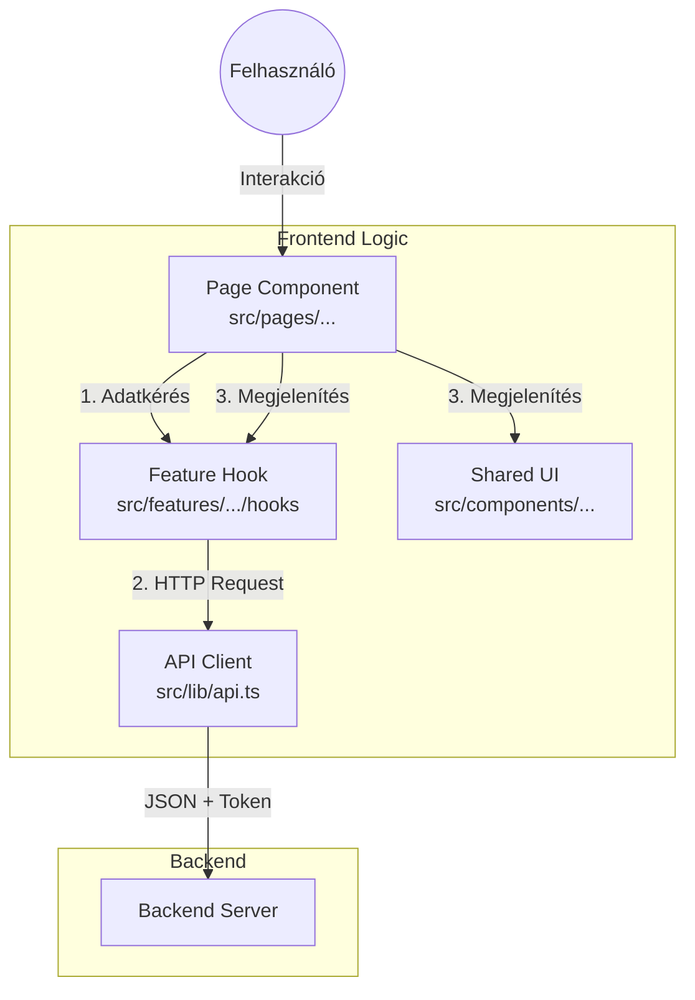
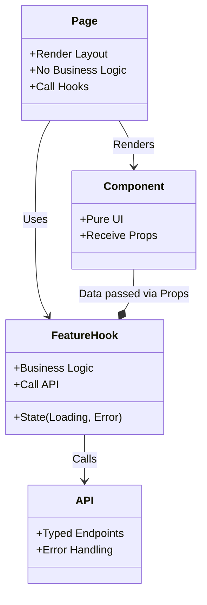
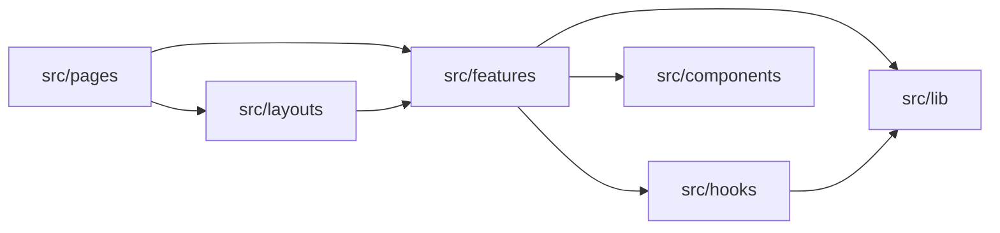

# 🛠️ Fejlesztői Segédlet és Statisztikák

Ez a dokumentum a projekt technikai mélyfúrását, vizuális diagramjait és a gyakori fejlesztői munkafolyamatokat tartalmazza.

---

## 📊 Projekt Statisztikák (2026.01.28)

A projekt **Feature-Based Architecture** struktúrája számokban:

| Kategória                      | Darabszám | Részletek                                                                                                     |
| :----------------------------- | :-------: | :------------------------------------------------------------------------------------------------------------ |
| **Üzleti Funkciók (Features)** |   **9**   | `auth`, `users`, `companies`, `positions`, `partnerships`, `applications`, `news`, `notifications`, `landing` |
| **Szerepkörök (Pages)**        |   **7**   | `admin`, `student`, `hr`, `mentor`, `teacher`, `university`, `landing`                                        |
| **Megosztott UI Komponensek**  |  **11**   | 2 db Atom (`ui/`), 9 db Molekula (`shared/`)                                                                  |
| **Globális Hook-ok**           |   **6**   | `useCRUD`, `useModal`, `useToast`, stb.                                                                       |

---

## 🧩 Architektúra Diagramok

### 1. Magas Szintű Felépítés

Hogyan épül fel egy tipikus oldal és honnan jön az adat?

### 2. Adatfolyam és Könyvtárszerkezet

A "Thin Page" architektúra vizualizációja.

### 3. Modul Kapcsolatok

Hogyan hivatkoznak egymásra a modulok?

---

## 🛠️ Fejlesztői Workflow-k (Munkafolyamatok)

### 1. Új Funkció Hozzáadása ("The Add Feature Protocol")

Ha pl. egy "Eseménynaptár" funkciót kell készíteni:

1.  **Mappa Létrehozása:**
    - Hozz létre egy új mappát: `src/features/calendar/`.
2.  **Struktúra Kialakítása:**
    - `src/features/calendar/components/` (Naptár nézet, Esemény kártya).
    - `src/features/calendar/hooks/` (`useEvents.ts`).
    - `src/features/calendar/types/` (Event interfész).
3.  **API Definíció:**
    - Frissítsd a `src/lib/api.ts`-t az új végpontokkal (`api.calendar.list()`).
4.  **Hook Implementálása:**
    - Írd meg a `useEvents` hook-ot, ami használja az `api.calendar`-t.
5.  **UI Építés:**
    - Készítsd el a komponenseket, amik megkapják az adatot a hook-tól.
6.  **Oldal Bekötése:**
    - Hozz létre új oldalt: `src/pages/student/CalendarPage.tsx`.

### 2. Új UI Komponens ("Atom vagy Molekula?")

Hova tegyem az új komponenst?

- **Atom (`src/components/ui/`):**
  - Ha ez egy nagyon alapvető építőkocka (pl. `Badge`, `Card`, `Input`).
  - Nincs benne logika, csak stílus.
- **Molekula (`src/components/shared/`):**
  - Ha több atomból áll vagy van minimális logikája (pl. `UserAvatar`, `Pagination`).
  - Újrahasznosítható bárhol az appban.
- **Feature Komponens (`src/features/.../components/`):**
  - Ha üzleti logikát tartalmaz vagy specifikus adatomodellhez kötött (pl. `CompanyCard`).
  - CSAK abban a feature-ben használják.

### 3. Hibajavítás (Debugging Flow)

Hogyan nyomozzunk le egy hibát?

1.  **Hol látszik a hiba?** (Azonosítsd az **Oldalt**: `src/pages/...`).
2.  **Honnan jön az adat?** (Keresd meg a **Feature Hook**-ot az oldalban).
3.  **Helyes az API hívás?** (Nézd meg a `src/lib/api.ts` definícióját).
4.  **Helyes a típus?** (Ellenőrizd a `src/types/api.types.ts`-t).
5.  **jó a Backend válasz?** (Network tab a böngészőben).

---

## 📝 Jelölésrendszer (Naming Conventions)

- **Fájlok:** `PascalCase.tsx` (komponensek), `camelCase.ts` (hook-ok, util-ok).
- **Mappák:** `kebab-case` (pl. `company-admins`).
- **Komponens Props:** Mindig definiálj `interface`-t (ne `any`-t használj).
- **Exportok:** Használj `named export`-ot (`export const Button...`) a `default export` helyett (kivéve oldalak).
